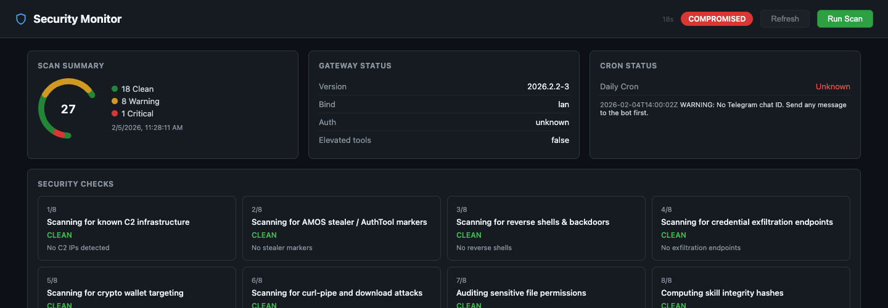
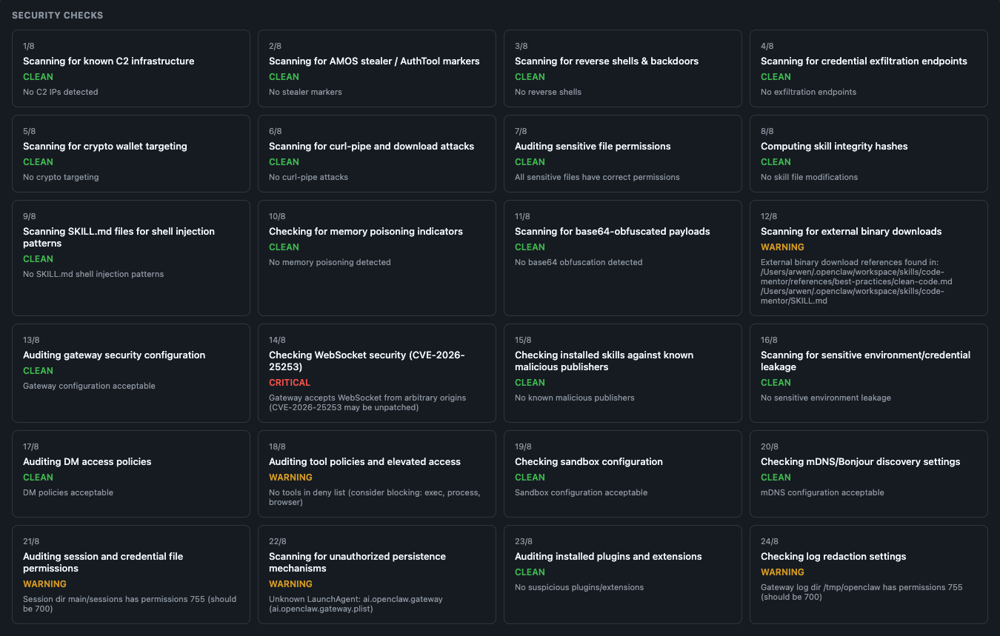
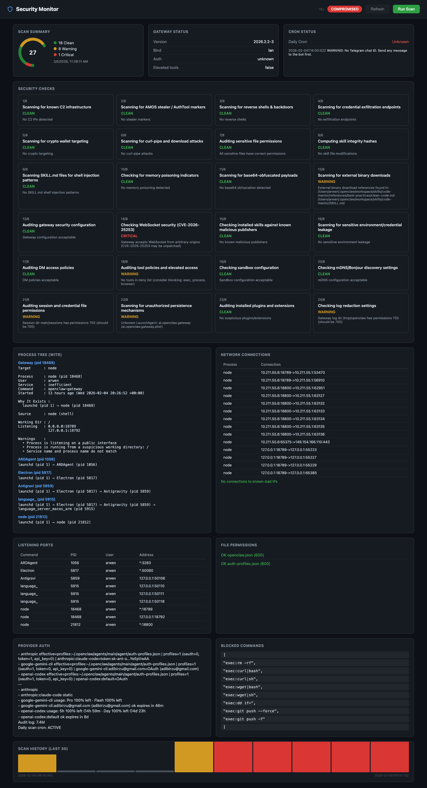
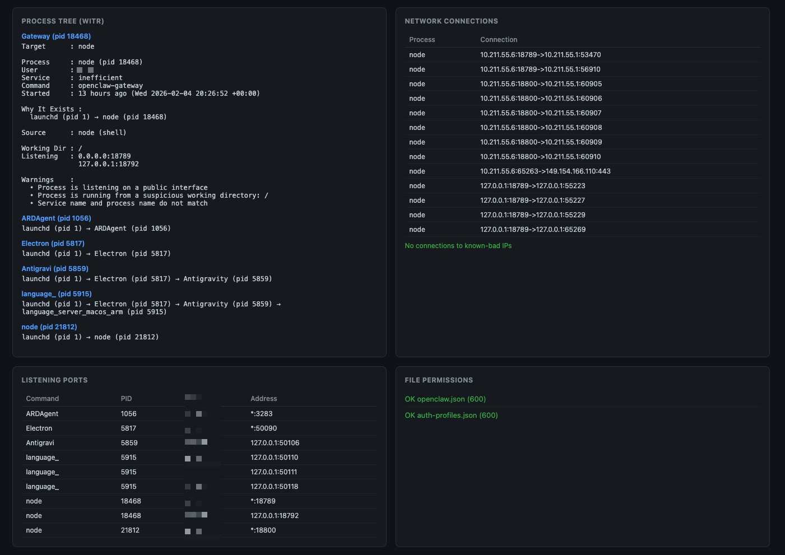
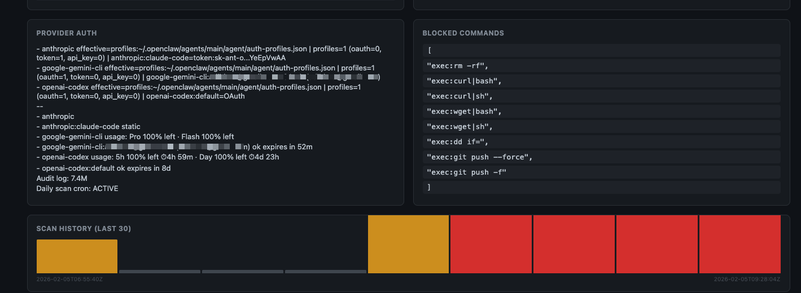

# OpenClaw Security Monitor

Proactive security monitoring, threat scanning, and real-time visibility for [OpenClaw](https://github.com/openclawai/openclaw) deployments. Detects threats from the **ClawHavoc** campaign (824+ malicious skills), **AMOS stealer**, **Vidar infostealer**, supply chain attacks, memory poisoning, log poisoning, **10 CVEs**, and **14+ GHSAs**.

## Why This Exists

In late January 2026, security researchers found that **12% of all ClawHub skills were malicious** — 341 out of 2,857 skills across multiple campaigns. By mid-February, this expanded to **824+ malicious skills** with **1,184 malicious packages** across 12 publisher accounts (Antiy CERT). The Snyk ToxicSkills study found **36% of all ClawHub skills contain security flaws** (3,984 scanned).

The primary campaign, ClawHavoc, delivered the Atomic Stealer (AMOS) macOS infostealer targeting crypto wallets, SSH credentials, and browser passwords. In February, Hudson Rock discovered **Vidar infostealer variants specifically targeting OpenClaw agent identities** — stealing openclaw.json, device.json, soul.md, and memory.md files.

Meanwhile, CVE-2026-25253 demonstrated that a single malicious link could achieve full remote code execution on any OpenClaw instance through WebSocket hijacking — even those bound to localhost. Since then, **9 additional CVEs and 14+ GHSAs** have been disclosed (path traversal, exec bypass, webhook forgery, log poisoning, and more).

**135,000+ instances** are exposed across 82 countries, with **12,812 exploitable via RCE**. Major security firms including CrowdStrike, Bitdefender, Palo Alto Networks, Cisco, and Kaspersky have issued advisories. Meta has banned OpenClaw from corporate devices.

This project provides defense-in-depth monitoring for self-hosted OpenClaw installations. **Minimum safe version: v2026.2.14**.

## Features

- **32-point security scan** covering C2 infrastructure, stealers, reverse shells, credential exfiltration, memory poisoning, SKILL.md injection, WebSocket hijacking, DM/tool/sandbox policies, persistence mechanisms, plugin auditing, Docker security, MCP hardening, and more
- **IOC database** with known C2 IPs, malicious domains, file hashes, publisher blacklists, and skill name patterns
- **Auto-updating IOC feeds** that pull latest threat intelligence from upstream
- **Web dashboard** (dark-themed, zero dependencies) with real-time status, process trees, network monitoring, and scan history
- **Daily automated scans** with Telegram alerting
- **Process ancestry tracking** via [witr](https://github.com/pranshuparmar/witr) integration

## Quick Start

```bash
# Clone
git clone https://github.com/adibirzu/openclaw-security-monitor.git
cd openclaw-security-monitor

# Make scripts executable
chmod +x scripts/*.sh

# Run a scan
./scripts/scan.sh

# Auto-fix common findings
./scripts/remediate.sh

# Start the web dashboard
node dashboard/server.js
# Open http://localhost:18800

# Update IOC database
./scripts/update-ioc.sh

# Install daily cron (06:00 UTC)
crontab -l | { cat; echo "0 6 * * * $(pwd)/scripts/daily-scan-cron.sh"; } | crontab -
```

## Architecture

```
openclaw-security-monitor/
  scripts/
    scan.sh              # 32-point threat scanner (v2.2)
    remediate.sh         # Orchestrator: scan + per-check remediation
    remediate/
      _common.sh         # Shared helpers (log, confirm, fix_perms)
      check-01-c2-ips.sh ... check-32-mcp-security.sh  # 32 per-check scripts
    dashboard.sh         # CLI security dashboard with witr
    network-check.sh     # Network activity monitor
    daily-scan-cron.sh   # Cron wrapper + Telegram alerts
    telegram-setup.sh    # Telegram notification setup
    update-ioc.sh        # IOC database updater
  ioc/
    c2-ips.txt           # Known C2 IP addresses
    malicious-domains.txt # Payload/exfil domains
    file-hashes.txt      # Known malicious file hashes
    malicious-publishers.txt  # Blacklisted ClawHub accounts
    malicious-skill-patterns.txt  # Malicious skill naming patterns
  dashboard/
    server.js            # Node.js HTTP server (zero npm deps)
    index.html           # Single-file dark-themed SPA
  docs/
    threat-model.md      # Threat model and attack vectors
```

## Scan Checks (32)

| # | Check | Severity | Detects |
|---|-------|----------|---------|
| 1 | C2 Infrastructure | CRITICAL | Known C2 IPs (91.92.242.x, etc.) in skill code |
| 2 | AMOS Stealer | CRITICAL | AuthTool, Atomic Stealer, osascript credential theft |
| 3 | Reverse Shells | CRITICAL | bash/python/perl/ruby/php/lua reverse shells |
| 4 | Credential Exfiltration | CRITICAL | webhook.site, pipedream, ngrok, burpcollaborator |
| 5 | Crypto Wallet Targeting | WARNING | Seed phrases, private keys, exchange API keys |
| 6 | Curl-Pipe Attacks | WARNING | `curl\|sh`, `wget\|bash`, remote script execution |
| 7 | File Permissions | WARNING | Config files with permissions > 600 |
| 8 | Skill Integrity | WARNING | SKILL.md hash changes since last scan |
| 9 | SKILL.md Injection | WARNING | Shell commands in Prerequisites/install sections |
| 10 | Memory Poisoning | CRITICAL | Prompt injection in SOUL.md, MEMORY.md, IDENTITY.md |
| 11 | Base64 Obfuscation | WARNING | Encoded payloads (glot.io-style delivery) |
| 12 | Binary Downloads | WARNING | .exe, .dmg, .pkg references, password-protected ZIPs |
| 13 | Gateway Config | CRITICAL | Auth disabled, LAN exposure, version check |
| 14 | WebSocket Security | CRITICAL | CVE-2026-25253 origin validation bypass |
| 15 | Malicious Publishers | CRITICAL | Skills from known-bad ClawHub accounts |
| 16 | Environment Leakage | WARNING | Skills reading .env, .ssh, .aws, keychain files |
| 17 | DM Policy Audit | WARNING | Channel dmPolicy set to "open", wildcard allowFrom |
| 18 | Tool Policy Audit | CRITICAL | Elevated tools with wildcard access, empty deny list |
| 19 | Sandbox Config | WARNING | Sandboxing disabled or set to "off" |
| 20 | mDNS/Bonjour Exposure | WARNING | mDNS broadcasting in "full" mode (leaks paths) |
| 21 | Session/Credential Perms | WARNING | Credentials dir, sessions, home dir permissions |
| 22 | Persistence Mechanisms | WARNING | Unauthorized LaunchAgents, crontabs, systemd services |
| 23 | Plugin/Extension Audit | CRITICAL | Extensions with exec patterns or malicious domains |
| 24 | Log Redaction Audit | WARNING | Log redaction disabled, world-readable log directories |
| 25 | Reverse Proxy Bypass | CRITICAL | Localhost trust bypass via misconfigured reverse proxy |
| 26 | Exec-Approvals Audit | CRITICAL | Unsafe remote exec approvals, missing approval prompts |
| 27 | Docker Security | CRITICAL | Root containers, Docker socket mount, privileged mode |
| 28 | Node.js CVE Check | WARNING | CVE-2026-21636 permission model bypass (Node < 22.12) |
| 29 | Plaintext Credentials | WARNING | Unencrypted API keys in config (sk-, AKIA, ghp_, xoxb-) |
| 30 | VS Code Trojans | CRITICAL | Fake ClawdBot/OpenClaw VS Code extensions (Aikido/JFrog) |
| 31 | Internet Exposure | WARNING | Gateway listening on non-loopback / wildcard interfaces |
| 32 | MCP Server Security | CRITICAL | Unrestricted MCP servers, prompt injection in tool descriptions |

## Remediation Guide

Step-by-step hardening for each security check, covering both macOS and Linux.

### Check 1: C2 Infrastructure — Known C2 IPs in skill code

**Severity:** CRITICAL

**What it means:** A skill contains IP addresses associated with known command-and-control servers (e.g., `91.92.242.30`). This strongly indicates the skill is malicious.

**Remediation:**
```bash
# Identify the affected skill
grep -rlE "91\.92\.242|95\.92\.242|54\.91\.154\.110" ~/.openclaw/workspace/skills/

# Remove the malicious skill
openclaw skill remove <skill-name>

# Or manually delete it
rm -rf ~/.openclaw/workspace/skills/<skill-name>

# Verify removal
grep -rlE "91\.92\.242" ~/.openclaw/workspace/skills/ # should return empty
```

### Check 2: AMOS Stealer / AuthTool Markers

**Severity:** CRITICAL

**What it means:** A skill contains patterns associated with the Atomic Stealer (AMOS) macOS infostealer, NovaStealer, or the "AuthTool" social engineering binary.

**Remediation:**
```bash
# Remove the malicious skill immediately
openclaw skill remove <skill-name>

# Check if AMOS was executed (macOS)
# Look for suspicious LaunchAgents
ls ~/Library/LaunchAgents/ | grep -ivE "com\.apple|com\.openclaw\.security"

# Check for unexpected login items (macOS)
osascript -e 'tell application "System Events" to get the name of every login item'

# Check browser extensions were not tampered with
ls ~/Library/Application\ Support/Google/Chrome/Default/Extensions/

# If AMOS was executed: rotate ALL credentials (SSH, AWS, crypto wallets, browser passwords)
```

### Check 3: Reverse Shells & Backdoors

**Severity:** CRITICAL

**What it means:** A skill contains reverse shell patterns (`nc -e`, `/dev/tcp/`, `socat exec`, etc.) or Gatekeeper bypass commands (`xattr -cr`).

**Remediation:**
```bash
# Remove the skill
openclaw skill remove <skill-name>

# Check for active reverse shells (macOS/Linux)
lsof -i -nP | grep -E "ESTABLISHED|SYN_SENT" | grep -vE ":443 |:80 |:53 "

# Kill any suspicious connections
kill -9 <PID>

# Re-enable Gatekeeper if bypassed (macOS)
sudo spctl --master-enable
sudo defaults write com.apple.LaunchServices LSQuarantine -bool true

# Check for quarantine removals (macOS)
xattr -l /Applications/*.app | grep quarantine
```

### Check 4: Credential Exfiltration Endpoints

**Severity:** CRITICAL

**What it means:** A skill sends data to known exfiltration services (webhook.site, pipedream.net, ngrok.io, etc.).

**Remediation:**
```bash
# Remove the skill
openclaw skill remove <skill-name>

# Block exfiltration domains at the host level
# macOS/Linux:
sudo sh -c 'echo "127.0.0.1 webhook.site" >> /etc/hosts'
sudo sh -c 'echo "127.0.0.1 pipedream.net" >> /etc/hosts'
sudo sh -c 'echo "127.0.0.1 hookbin.com" >> /etc/hosts'
sudo sh -c 'echo "127.0.0.1 requestbin.com" >> /etc/hosts'

# Flush DNS cache (macOS)
sudo dscacheutil -flushcache && sudo killall -HUP mDNSResponder
# Flush DNS cache (Linux)
sudo systemd-resolve --flush-caches
```

### Check 5: Crypto Wallet Targeting

**Severity:** WARNING

**What it means:** A skill references crypto wallet private keys, seed phrases, or exchange API keys.

**Remediation:**
```bash
# Remove the skill
openclaw skill remove <skill-name>

# Move crypto wallets to hardware wallets (Ledger, Trezor)
# Rotate exchange API keys immediately

# Restrict filesystem access (macOS)
chmod 700 ~/Library/Application\ Support/Phantom
chmod 700 ~/Library/Application\ Support/MetaMask

# Check if wallet files were accessed recently
# macOS:
mdls -name kMDItemLastUsedDate ~/Library/Application\ Support/Phantom/*
# Linux:
stat -c "%x" ~/.config/phantom/*
```

### Check 6: Curl-Pipe Attacks

**Severity:** WARNING

**What it means:** A skill uses `curl | sh` or `wget | bash` patterns to download and execute remote scripts.

**Remediation:**
```bash
# Remove the skill
openclaw skill remove <skill-name>

# Review and restrict agent tool access
openclaw config set tools.deny '["exec","process"]'

# Block curl-pipe at the shell level (add to ~/.bashrc or ~/.zshrc)
# This creates an alias that warns on pipe-to-shell patterns:
alias curl='() { if [[ "$*" == *"|"*"sh"* ]] || [[ "$*" == *"|"*"bash"* ]]; then echo "BLOCKED: curl-pipe detected"; return 1; fi; command curl "$@"; }'
```

### Check 7: File Permission Audit

**Severity:** WARNING

**What it means:** Sensitive configuration files (openclaw.json, auth-profiles.json) are readable by other users.

**Remediation:**
```bash
# Fix permissions (macOS/Linux)
chmod 600 ~/.openclaw/openclaw.json
chmod 600 ~/.openclaw/agents/main/agent/auth-profiles.json
chmod 600 ~/.openclaw/exec-approvals.json
chmod 700 ~/.openclaw

# Set default umask in shell profile (add to ~/.bashrc or ~/.zshrc)
echo 'umask 077' >> ~/.zshrc
```

### Check 8: Skill Integrity Hashes

**Severity:** WARNING

**What it means:** SKILL.md files have been modified since the last scan, which could indicate tampering or supply chain compromise.

**Remediation:**
```bash
# Review what changed
diff ~/.openclaw/logs/skill-hashes.sha256.prev ~/.openclaw/logs/skill-hashes.sha256

# For each changed skill, inspect the diff
cd ~/.openclaw/workspace/skills/<skill-name>
git diff HEAD~1 SKILL.md   # If under version control

# If change is unexpected, reinstall from ClawHub
openclaw skill remove <skill-name>
openclaw skill install <skill-name>

# Enable skill pinning (if supported)
openclaw config set skills.autoUpdate false
```

### Check 9: SKILL.md Shell Injection

**Severity:** WARNING

**What it means:** A SKILL.md contains suspicious install instructions that try to get the user or agent to run shell commands (Snyk CVE-2026-22708).

**Remediation:**
```bash
# Review the suspicious SKILL.md
cat ~/.openclaw/workspace/skills/<skill-name>/SKILL.md | grep -iE "terminal|curl|wget|install|download"

# Remove the skill if instructions are clearly malicious
openclaw skill remove <skill-name>

# Never run commands from SKILL.md Prerequisites without reviewing them first
# Configure agent to not auto-execute installation commands
openclaw config set tools.deny '["exec"]'
```

### Check 10: Memory Poisoning

**Severity:** CRITICAL

**What it means:** SOUL.md, MEMORY.md, or IDENTITY.md contain prompt injection patterns ("ignore previous instructions", "you are now", etc.).

**Remediation:**
```bash
# Review poisoned files
cat ~/.openclaw/workspace/SOUL.md
cat ~/.openclaw/workspace/MEMORY.md
cat ~/.openclaw/workspace/IDENTITY.md

# Remove injected content manually (edit the file, remove injected lines)
# Or restore from backup:
git checkout HEAD -- ~/.openclaw/workspace/SOUL.md

# Protect memory files from modification
chmod 444 ~/.openclaw/workspace/SOUL.md
chmod 444 ~/.openclaw/workspace/MEMORY.md
chmod 444 ~/.openclaw/workspace/IDENTITY.md

# Investigate which skill wrote to memory
grep -rl "SOUL\.md\|MEMORY\.md" ~/.openclaw/workspace/skills/
```

### Check 11: Base64 Obfuscation

**Severity:** WARNING

**What it means:** A skill uses base64 encoding/decoding, which is a common technique to hide malicious payloads (as seen in the ClawHavoc campaign via glot.io).

**Remediation:**
```bash
# Review the base64 content
grep -rn "base64" ~/.openclaw/workspace/skills/<skill-name>/

# Decode and inspect the payload
echo "<base64-string>" | base64 -d

# Remove if malicious
openclaw skill remove <skill-name>

# Monitor for base64 activity in agent logs
grep -i "base64" ~/.openclaw/logs/*.log
```

### Check 12: External Binary Downloads

**Severity:** WARNING

**What it means:** A skill references downloadable binaries (.exe, .dmg, .pkg, .zip with password) or known malicious download URLs.

**Remediation:**
```bash
# Remove the skill
openclaw skill remove <skill-name>

# Check Downloads folder for suspicious binaries (macOS)
ls -la ~/Downloads/*.{exe,dmg,pkg,zip,msi} 2>/dev/null

# Verify Gatekeeper is active (macOS)
spctl --status  # should say "assessments enabled"

# Check if any unsigned apps were installed (macOS)
sudo find /Applications -name "*.app" -exec codesign -v {} \; 2>&1 | grep "invalid"

# Linux: check /tmp and /var/tmp for suspicious downloads
find /tmp /var/tmp -name "*.sh" -o -name "*.elf" -o -name "*.bin" -mtime -7 2>/dev/null
```

### Check 13: Gateway Security Configuration

**Severity:** CRITICAL

**What it means:** The OpenClaw gateway is bound to LAN (accessible from network) or has authentication disabled.

**Remediation:**
```bash
# Bind gateway to localhost only
openclaw config set gateway.bind localhost

# Enable authentication
openclaw config set gateway.auth.mode token
# Or use OIDC (enterprise)
openclaw config set gateway.auth.mode oidc

# Verify configuration
openclaw config get gateway.bind
openclaw config get gateway.auth.mode

# Check what's actually listening
lsof -i :18789 -nP   # Should show 127.0.0.1, not 0.0.0.0

# Update to latest version to patch CVE-2026-25253
openclaw update
```

### Check 14: WebSocket Security (CVE-2026-25253)

**Severity:** CRITICAL

**What it means:** The gateway WebSocket accepts connections from arbitrary origins, enabling 1-click RCE via a malicious webpage.

**Remediation:**
```bash
# Update OpenClaw to latest version (patch included in 2026.2.3+)
openclaw update

# Verify the fix
curl -s -o /dev/null -w "%{http_code}" \
  -H "Connection: Upgrade" -H "Upgrade: websocket" \
  -H "Sec-WebSocket-Key: dGhlIHNhbXBsZSBub25jZQ==" \
  -H "Sec-WebSocket-Version: 13" \
  -H "Origin: http://evil.attacker.com" \
  http://127.0.0.1:18789/
# Should return 403 or 401, NOT 101

# If update is not available, restrict gateway to localhost
openclaw config set gateway.bind localhost

# Add firewall rule (macOS)
sudo /usr/libexec/ApplicationFirewall/socketfilterfw --add /usr/local/bin/node
# Linux (iptables)
sudo iptables -A INPUT -p tcp --dport 18789 -s 127.0.0.1 -j ACCEPT
sudo iptables -A INPUT -p tcp --dport 18789 -j DROP
```

### Check 15: Malicious Publisher Detection

**Severity:** CRITICAL

**What it means:** An installed skill references a known malicious ClawHub publisher (hightower6eu, zaycv, Ddoy233, etc.).

**Remediation:**
```bash
# Remove all skills from the malicious publisher
openclaw skill remove <skill-name>

# Check for other skills from the same publisher
grep -rl "<publisher-name>" ~/.openclaw/workspace/skills/

# Review recently installed skills
ls -lt ~/.openclaw/workspace/skills/ | head -20

# Only install skills from verified publishers
# Check skill reputation before installing:
# https://www.koi.ai (Clawdex reputation checker)
```

### Check 16: Sensitive Environment Leakage

**Severity:** WARNING / CRITICAL (if hardcoded API keys found)

**What it means:** A skill reads sensitive files (.env, .ssh, .aws/credentials) or contains hardcoded API keys / Moltbook tokens.

**Remediation:**
```bash
# Remove the skill
openclaw skill remove <skill-name>

# Rotate exposed credentials immediately
# OpenAI:
# Go to https://platform.openai.com/api-keys and regenerate
# Anthropic:
# Go to https://console.anthropic.com/settings/keys and regenerate

# Move secrets to a secrets manager instead of .env files
# macOS: Use Keychain Access
security add-generic-password -a "$USER" -s "OPENAI_API_KEY" -w "<new-key>"

# Linux: Use pass or secret-tool
secret-tool store --label="OPENAI_API_KEY" service openai key api

# Restrict skill filesystem access
openclaw config set sandbox.mode all
```

### Check 17: DM Policy Audit

**Severity:** WARNING

**What it means:** A messaging channel has `dmPolicy=open`, allowing anyone to message your agent — enabling social engineering and prompt injection from untrusted sources.

**Remediation:**
```bash
# Set DM policy to restricted for each channel
openclaw config set channels.whatsapp.dmPolicy restricted
openclaw config set channels.telegram.dmPolicy restricted
openclaw config set channels.discord.dmPolicy restricted

# Set explicit allowFrom list
openclaw config set channels.telegram.allowFrom '["your-user-id"]'

# Disable unused channels entirely
openclaw config set channels.signal.enabled false
```

### Check 18: Tool Policy / Elevated Tools Audit

**Severity:** CRITICAL

**What it means:** Elevated tools are enabled with wildcard access, or the tool deny list is empty — allowing the agent to execute arbitrary commands.

**Remediation:**
```bash
# Restrict elevated tools to specific principals
openclaw config set tools.elevated.allowFrom '["your-user-id"]'

# Add dangerous tools to the deny list
openclaw config set tools.deny '["exec","process","browser","filesystem-write"]'

# Require approval for elevated actions
openclaw config set tools.elevated.requireApproval true

# Review current tool permissions
openclaw config get tools
```

### Check 19: Sandbox Configuration

**Severity:** WARNING

**What it means:** Sandboxing is disabled, allowing skills to access the full filesystem and network without restriction.

**Remediation:**
```bash
# Enable sandboxing
openclaw config set sandbox.mode all

# Restrict workspace access to read-only where possible
openclaw config set sandbox.workspaceAccess ro

# For Docker deployments (recommended for production):
# Use gVisor runtime for stronger isolation
docker run --runtime=runsc --read-only \
  -v ~/.openclaw:/home/openclaw/.openclaw:ro \
  openclaw/gateway
```

### Check 20: mDNS/Bonjour Exposure

**Severity:** WARNING

**What it means:** mDNS is broadcasting in "full" mode, advertising the gateway's presence, paths, and SSH port to the local network.

**Remediation:**
```bash
# Disable mDNS broadcasting
openclaw config set discovery.mdns.mode off

# Or set to minimal (name only, no paths)
openclaw config set discovery.mdns.mode minimal

# Verify mDNS is not broadcasting (macOS)
dns-sd -B _openclaw._tcp local
# Should return no results

# Disable Bonjour for the gateway specifically (macOS)
sudo defaults write /Library/Preferences/com.apple.mDNSResponder.plist NoMulticastAdvertisements -bool YES
```

### Check 21: Session & Credential Permissions

**Severity:** WARNING

**What it means:** Credential directories, session files, or the OpenClaw home directory have overly permissive permissions.

**Remediation:**
```bash
# Fix all permissions at once
chmod 700 ~/.openclaw
chmod 700 ~/.openclaw/credentials 2>/dev/null
chmod 700 ~/.openclaw/agents/*/sessions 2>/dev/null
find ~/.openclaw/credentials -type f -name "*.json" -exec chmod 600 {} \; 2>/dev/null
find ~/.openclaw -name "auth-profiles.json" -exec chmod 600 {} \;

# Verify
ls -la ~/.openclaw/
ls -la ~/.openclaw/credentials/
```

### Check 22: Persistence Mechanisms

**Severity:** WARNING

**What it means:** There are LaunchAgents, cron entries, or systemd services referencing OpenClaw that are not the known security monitor.

**Remediation:**
```bash
# macOS: Review LaunchAgents
ls -la ~/Library/LaunchAgents/ | grep -iE "openclaw|clawdbot|moltbot"
# Remove unauthorized agents:
launchctl unload ~/Library/LaunchAgents/<suspicious-plist>
rm ~/Library/LaunchAgents/<suspicious-plist>

# Check system-level LaunchDaemons (requires root)
sudo ls /Library/LaunchDaemons/ | grep -iE "openclaw|clawdbot"

# Linux: Review systemd services
systemctl --user list-units --type=service | grep -iE "openclaw|clawdbot"
# Disable unauthorized services:
systemctl --user disable --now <service-name>

# Review crontab
crontab -l | grep -iE "openclaw|clawdbot|moltbot"
# Edit and remove suspicious entries:
crontab -e
```

### Check 23: Plugin/Extension Security

**Severity:** CRITICAL

**What it means:** An installed extension contains code execution patterns (`eval()`, `exec()`, `child_process`) or references known malicious domains.

**Remediation:**
```bash
# List installed extensions
ls ~/.openclaw/extensions/

# Review suspicious extension code
grep -rn "eval\|exec\|child_process\|fetch(" ~/.openclaw/extensions/<ext-name>/

# Remove the extension
rm -rf ~/.openclaw/extensions/<ext-name>

# Disable extension loading if not needed
openclaw config set extensions.enabled false

# Only install extensions from verified sources
```

### Check 24: Log Redaction Audit

**Severity:** WARNING

**What it means:** Log redaction is disabled (sensitive data like API keys and passwords may appear in plaintext in logs), or log directories are world-readable.

**Remediation:**
```bash
# Enable log redaction
openclaw config set logging.redactSensitive true

# Fix log directory permissions
chmod 700 ~/.openclaw/logs
chmod 700 /tmp/openclaw 2>/dev/null

# Verify logs don't contain sensitive data
grep -iE "sk-[a-zA-Z0-9]{10}|password|token.*=" ~/.openclaw/logs/*.log

# Set up log rotation (macOS - newsyslog)
sudo sh -c 'echo "$HOME/.openclaw/logs/*.log 640 7 1000 * J" >> /etc/newsyslog.conf'
# Linux - logrotate
cat > /etc/logrotate.d/openclaw << 'LOGROTATE'
/home/*/.openclaw/logs/*.log {
    weekly
    rotate 4
    compress
    missingok
    notifempty
    create 0600 root root
}
LOGROTATE
```

### Check 25: Reverse Proxy Localhost Trust Bypass

**Severity:** CRITICAL

**What it means:** The gateway is bound to LAN without `trustedProxies` configured, or `dangerouslyDisableDeviceAuth` is enabled. External attackers can bypass authentication by appearing as localhost through a reverse proxy (28% of exposed instances had this flaw per Penligent).

**Remediation:**
```bash
# Configure trusted proxies
openclaw config set gateway.trustedProxies '["192.168.1.1"]'

# Never disable device auth
openclaw config set gateway.dangerouslyDisableDeviceAuth false

# If using Nginx, ensure X-Forwarded-For is properly set
# In nginx.conf:
# proxy_set_header X-Real-IP $remote_addr;
# proxy_set_header X-Forwarded-For $proxy_add_x_forwarded_for;

# Verify
openclaw config get gateway.trustedProxies
```

### Check 26: Exec-Approvals Configuration

**Severity:** CRITICAL

**What it means:** The `exec-approvals.json` allows remote command execution without confirmation. The CVE-2026-25253 exploit chain used `exec.approvals.set` to disable confirmation prompts.

**Remediation:**
```bash
# Set exec approvals to deny for non-owner nodes
# Edit ~/.openclaw/exec-approvals.json manually:
# Set "security": "deny" for all non-owner nodes
# Set "ask": "always"

# Fix permissions
chmod 600 ~/.openclaw/exec-approvals.json

# Verify
cat ~/.openclaw/exec-approvals.json | python3 -m json.tool
```

### Check 27: Docker Container Security

**Severity:** CRITICAL

**What it means:** OpenClaw Docker containers are running as root, with Docker socket mounted, or in privileged mode. CVE-2026-24763 was a command injection in the Docker sandbox.

**Remediation:**
```bash
# Run OpenClaw container with hardened settings
docker run -d \
  --name openclaw \
  --user 1000:1000 \
  --cap-drop ALL \
  --no-new-privileges \
  --read-only \
  --tmpfs /tmp:noexec,nosuid,size=100m \
  --memory 512m \
  --cpus 1.0 \
  --pids-limit 100 \
  -v ~/.openclaw:/home/openclaw/.openclaw:rw \
  openclaw/gateway

# NEVER mount Docker socket
# BAD: -v /var/run/docker.sock:/var/run/docker.sock

# Use gVisor for stronger isolation
docker run --runtime=runsc ...
```

### Check 28: Node.js Version / CVE-2026-21636

**Severity:** WARNING

**What it means:** Node.js version is below 22.12.0 and vulnerable to CVE-2026-21636 (permission model bypass via Unix Domain Sockets), which allows sandbox escape.

**Remediation:**
```bash
# macOS
brew install node@22
# Or update existing
brew upgrade node

# Linux (NodeSource)
curl -fsSL https://deb.nodesource.com/setup_22.x | sudo bash -
sudo apt-get install -y nodejs

# Verify
node --version  # Should be >= v22.12.0
```

### Check 29: Plaintext Credential Detection

**Severity:** WARNING

**What it means:** OpenClaw config or credential files contain plaintext API keys (OpenAI `sk-`, AWS `AKIA`, GitHub `ghp_`, Slack `xoxb-`). The `~/.openclaw` directory is a standard target for infostealers.

**Remediation:**
```bash
# macOS: Move secrets to Keychain
security add-generic-password -a "$USER" -s "OPENAI_API_KEY" -w "<key>"

# Linux: Use pass or secret-tool
pass insert openai/api-key
# Or
secret-tool store --label="OPENAI_API_KEY" service openai key api

# Use environment variables instead of config files
export OPENAI_API_KEY=$(security find-generic-password -s "OPENAI_API_KEY" -w)

# Set up detect-secrets baseline
pip install detect-secrets
detect-secrets scan ~/.openclaw/ > .secrets.baseline
```

### Check 30: VS Code Extension Trojan Detection

**Severity:** CRITICAL

**What it means:** Fake "ClawdBot Agent" VS Code extensions have been discovered that install ScreenConnect RAT and remote access trojans. OpenClaw has NO official VS Code extension.

**Remediation:**
```bash
# Remove any clawdbot/openclaw VS Code extensions immediately
rm -rf ~/.vscode/extensions/*clawdbot*
rm -rf ~/.vscode/extensions/*openclaw*
rm -rf ~/.vscode/extensions/*moltbot*

# Check for ScreenConnect/ConnectWise artifacts
# macOS:
find /Applications -name "*ScreenConnect*" -o -name "*ConnectWise*"
# Linux:
find /opt -name "*screenconnect*" -o -name "*connectwise*"

# Scan for persistence left by the trojan
ls ~/Library/LaunchAgents/ | grep -ivE "com\.apple"
```

### Check 31: Internet Exposure Detection

**Severity:** WARNING

**What it means:** The gateway is listening on non-loopback interfaces, potentially exposing it to the internet. Over 21,000 OpenClaw instances were found on Shodan with zero authentication.

**Remediation:**
```bash
# Bind to localhost only
openclaw config set gateway.bind localhost

# Verify
lsof -i :18789 -nP | grep LISTEN
# Should show 127.0.0.1:18789, NOT *:18789 or 0.0.0.0:18789

# Add firewall rules (macOS pf)
echo "block in on ! lo0 proto tcp to any port 18789" | sudo pfctl -ef -

# Linux (iptables)
sudo iptables -A INPUT -p tcp --dport 18789 ! -s 127.0.0.1 -j DROP

# Change default port (reduce scan surface)
openclaw config set gateway.port 28789
```

### Check 32: MCP Server Security

**Severity:** CRITICAL

**What it means:** MCP servers are configured with unrestricted access (`enableAllProjectMcpServers=true`) or contain prompt injection patterns in tool descriptions — enabling tool poisoning and rug-pull attacks.

**Remediation:**
```bash
# Use explicit MCP server allowlist
openclaw config set mcp.enableAllProjectMcpServers false

# Review each MCP server's tool descriptions
cat ~/.openclaw/mcp.json | python3 -m json.tool

# Pin MCP server versions (prevent rug pulls)
# In mcp.json, use specific versions, not "latest"

# Run MCP servers in separate containers
# Use Cisco MCP Scanner for analysis:
# https://github.com/cisco-ai-defense/mcp-scanner

# Audit MCP server network access
# Check which external endpoints each server contacts
lsof -i -nP | grep -E "node|mcp" | grep ESTABLISHED
```

## Auto-Remediation

The `remediate.sh` orchestrator runs `scan.sh`, parses the results, skips CLEAN checks, and executes per-check remediation scripts for each WARNING/CRITICAL finding.

```bash
# Scan + remediate (interactive)
./scripts/remediate.sh

# Auto-approve all fixes
./scripts/remediate.sh --yes

# Dry run — preview what would be fixed
./scripts/remediate.sh --dry-run

# Remediate a single check
./scripts/remediate.sh --check 7 --dry-run

# Run all 32 scripts without scanning
./scripts/remediate.sh --all
```

### Per-Check Remediation Scripts

Each of the 32 scan checks has a dedicated remediation script in `scripts/remediate/`. Scripts are standalone, support `--yes` and `--dry-run`, and return exit 0 (fixed), 1 (failed), or 2 (nothing to fix).

| Script | Check | Type |
|--------|-------|------|
| `check-01-c2-ips.sh` | C2 Infrastructure | Guidance |
| `check-02-amos-stealer.sh` | AMOS Stealer | Guidance |
| `check-03-reverse-shells.sh` | Reverse Shells | Auto-fix (Gatekeeper) |
| `check-04-exfil-endpoints.sh` | Exfil Endpoints | Auto-fix (/etc/hosts) |
| `check-05-crypto-wallet.sh` | Crypto Wallets | Guidance |
| `check-06-curl-pipe.sh` | Curl-Pipe Attacks | Auto-fix (tools.deny) |
| `check-07-file-perms.sh` | File Permissions | Auto-fix (chmod) |
| `check-08-skill-integrity.sh` | Skill Integrity | Guidance |
| `check-09-skillmd-inject.sh` | SKILL.md Injection | Guidance |
| `check-10-memory-poison.sh` | Memory Poisoning | Guidance |
| `check-11-base64-obfusc.sh` | Base64 Obfuscation | Guidance |
| `check-12-binary-dl.sh` | Binary Downloads | Guidance |
| `check-13-gateway-config.sh` | Gateway Config | Auto-fix (bind/auth) |
| `check-14-websocket-sec.sh` | WebSocket Security | Guidance |
| `check-15-malicious-pub.sh` | Malicious Publishers | Guidance |
| `check-16-env-leakage.sh` | Env Leakage | Guidance |
| `check-17-dm-policy.sh` | DM Policy | Auto-fix (restricted) |
| `check-18-tool-policy.sh` | Tool Policy | Auto-fix (deny list) |
| `check-19-sandbox-config.sh` | Sandbox Config | Auto-fix (enable) |
| `check-20-mdns-exposure.sh` | mDNS Exposure | Auto-fix (disable) |
| `check-21-session-perms.sh` | Session Perms | Auto-fix (chmod) |
| `check-22-persistence.sh` | Persistence | Guidance |
| `check-23-plugin-audit.sh` | Plugin Audit | Guidance |
| `check-24-log-redaction.sh` | Log Redaction | Auto-fix (enable) |
| `check-25-proxy-bypass.sh` | Proxy Bypass | Auto-fix (config) |
| `check-26-exec-approvals.sh` | Exec Approvals | Auto-fix (perms) |
| `check-27-docker-sec.sh` | Docker Security | Guidance |
| `check-28-nodejs-cve.sh` | Node.js CVE | Guidance |
| `check-29-plaintext-creds.sh` | Plaintext Creds | Guidance |
| `check-30-vscode-trojans.sh` | VS Code Trojans | Auto-fix (remove) |
| `check-31-internet-expose.sh` | Internet Exposure | Auto-fix (bind) |
| `check-32-mcp-security.sh` | MCP Security | Auto-fix (config) |

**Auto-fix** scripts modify the system (permissions, config settings, /etc/hosts).
**Guidance** scripts print manual instructions for destructive or external actions (skill removal, credential rotation, Docker changes).

### Exit codes

| Code | Meaning |
|------|---------|
| 0 | Fixes applied successfully |
| 1 | Some fixes failed |
| 2 | Nothing to fix |

All actions are logged to `~/.openclaw/logs/remediation.log`.

## IOC Database

### C2 IP Addresses
| IP | Campaign | Notes |
|----|----------|-------|
| `91.92.242.30` | ClawHavoc | Primary AMOS C2, used by 335 skills |
| `95.92.242.30` | ClawHavoc | Secondary C2 |
| `96.92.242.30` | ClawHavoc | Secondary C2 |
| `54.91.154.110` | ClawHavoc | Reverse shell endpoint (port 13338) |
| `202.161.50.59` | ClawHavoc | Payload staging |

### Malicious Domains
| Domain | Type | Notes |
|--------|------|-------|
| `install.app-distribution.net` | Payload | AMOS installer distribution |
| `glot.io` | Hosting | Base64-obfuscated shell scripts (legitimate service abused) |
| `webhook.site` | Exfiltration | Data exfil via webhooks |
| `pipedream.net` | Exfiltration | Data exfil |
| `ngrok.io` | Tunneling | Reverse tunnel for exfiltration |
| `github.com/hedefbari` | Payload | Attacker GitHub hosting openclaw-agent.zip |
| `github.com/Ddoy233` | Payload | openclawcli repo - Windows infostealer |
| `download.setup-service.com` | Decoy | Decoy domain string in bash payload scripts |

### Known File Hashes (SHA-256)
| Hash | File | Platform |
|------|------|----------|
| `17703b3d...42283` | openclaw-agent.exe | Windows |
| `1e6d4b05...e2298` | x5ki60w1ih838sp7 | macOS (AMOS) |
| `0e52566c...4dd65` | unknown | macOS (AMOS variant) |
| `79e8f3f7...2bc1f2` | skill-archive | Any |

### Malicious Publisher Blacklist
| Publisher | Skills | Campaign | Source |
|-----------|--------|----------|--------|
| `hightower6eu` | 314 | ClawHavoc (crypto, finance, social lures) | Koi Security |
| `zaycv` | multiple | Bloom campaign (ClawHub + GitHub) | Bloom/JFrog |
| `noreplyboter` | 2 | Reverse shells (polymarket-all-in-one, better-polymarket) | Bloom/JFrog |
| `rjnpage` | 1 | .env exfiltration (rankaj) | Bloom/JFrog |
| `aslaep123` | multiple | Silent exfil (reddit-trends) | Bloom/JFrog |
| `gpaitai` | multiple | Bloom campaign | Bloom/JFrog |
| `lvy19811120-gif` | multiple | Bloom campaign | Bloom/JFrog |
| `Ddoy233` | 1 | Windows infostealer (openclawcli.zip) | Snyk/OpenSourceMalware |
| `hedefbari` | 1 | openclaw-agent.zip payload hosting | Koi Security |

### Skill Name Patterns
Malicious skills mimic popular categories:
- **Typosquats** (29): `clawhub`, `clawhubb`, `clawwhub`, `cllawhub`, `clawhubcli`, `clawdhub1`
- **Crypto** (111): `solana-wallet-*`, `phantom-wallet-*`, `bybit-agent`, `eth-gas-*`
- **Prediction markets** (34): `polymarket-*`, `better-polymarket`, `polymarket-all-in-one`
- **YouTube** (57): `youtube-summarize-*`, `youtube-*-pro`
- **Auto-updaters** (28): `auto-updat*`
- **Finance** (51): `yahoo-finance`, `stock-track*`
- **Google Workspace** (17): `google-workspace-*`, `gmail-*`, `gdrive-*`
- **Social/job lures** (Bloom): `reddit-trends`, `linkedin-job-application`, `reddit-*`, `linkedin-*`
- **Known malicious** (specific): `rankaj`, `openclawcli`

## IOC Auto-Updater

The `update-ioc.sh` script:
1. Checks upstream GitHub repo for IOC database updates
2. Scans active network connections against known C2 IPs
3. Validates installed skills against malicious publisher and pattern databases
4. Computes file hashes and checks against known malicious hashes

```bash
# Check for updates without applying
./scripts/update-ioc.sh --check-only

# Download and apply updates
./scripts/update-ioc.sh
```

## Web Dashboard

Zero-dependency Node.js server on port 18800 with:
- Scan summary donut chart
- 32 color-coded security check cards
- Gateway status and configuration audit
- Process tree via `witr` showing ancestry chains
- Network connections and listening ports
- File permissions and provider auth status
- Scan history timeline (last 30 scans)
- Auto-refresh every 30s + on-demand scan button

### Screenshots

**Dashboard overview** — header with scan summary donut, gateway status, and cron status:



**Security checks grid** — all 32 checks with color-coded status cards (green=clean, yellow=warning, red=critical):



**Full dashboard** — complete view including process tree, network connections, and scan history:



**Process tree, network connections, and listening ports:**



**Provider auth, blocked commands, and scan history timeline:**



### API Endpoints

| Route | Method | Description |
|-------|--------|-------------|
| `/` | GET | Dashboard UI |
| `/api/scan` | GET | Last cached scan result |
| `/api/scan/run` | POST | Run scan on-demand |
| `/api/dashboard` | GET | CLI dashboard data |
| `/api/network` | GET | Network connections |
| `/api/process-tree` | GET | Process ancestry via witr |
| `/api/logs/scan` | GET | Scan log history |
| `/api/logs/cron` | GET | Cron log entries |
| `/api/status` | GET | Server uptime + gateway health |

### LaunchAgent (macOS)

The plist template in `docs/` uses `__HOME__` placeholders. Install with:

```bash
# Generate plist with your home directory and install
sed "s|__HOME__|$HOME|g" docs/com.openclaw.security-dashboard.plist \
  > ~/Library/LaunchAgents/com.openclaw.security-dashboard.plist

# Load the service
launchctl load ~/Library/LaunchAgents/com.openclaw.security-dashboard.plist

# Verify
curl -s http://localhost:18800/api/status | python3 -m json.tool
```

## CVE Coverage

| CVE | Description | Check |
|-----|-------------|-------|
| CVE-2026-25253 | 1-Click RCE via WebSocket hijacking | #14: WebSocket origin validation |
| CVE-2026-21636 | Permission model bypass (Node.js UDS sandbox escape) | #18: Tool policy audit, #19: Sandbox config, #28: Node.js version |
| CVE-2026-22708 | Indirect prompt injection | #9: SKILL.md injection, #10: Memory poisoning |
| CVE-2026-24763 | Command injection | #3: Reverse shell patterns |
| CVE-2026-25157 | Command injection | #6: Curl-pipe attacks |
| CVE-2026-24763 | Docker sandbox command injection | #27: Docker container security |

## Threat Intelligence Sources

This project's detection patterns are built from published security research:

| Source | Report | What We Use |
|--------|--------|-------------|
| [Koi Security](https://www.koi.ai/blog/clawhavoc-341-malicious-clawedbot-skills-found-by-the-bot-they-were-targeting) | ClawHavoc: 341 Malicious Skills | C2 IPs, malicious publishers, skill patterns, AMOS indicators |
| [The Hacker News](https://thehackernews.com/2026/02/researchers-find-341-malicious-clawhub.html) | 341 Malicious ClawHub Skills | Campaign timeline, attack methodology |
| [VirusTotal](https://blog.virustotal.com/2026/02/from-automation-to-infection-how.html) | From Automation to Infection | File hashes, publisher identification, payload analysis |
| [Snyk](https://snyk.io/articles/skill-md-shell-access/) | From SKILL.md to Shell Access | SKILL.md injection patterns, memory poisoning techniques |
| [The Register](https://www.theregister.com/2026/02/02/openclaw_security_issues) | OpenClaw Security Issues | CVE details, ecosystem analysis |
| [SecurityWeek](https://www.securityweek.com/vulnerability-allows-hackers-to-hijack-openclaw-ai-assistant/) | Hijack OpenClaw AI Assistant | WebSocket hijacking details |
| [Cisco Blogs](https://blogs.cisco.com/ai/personal-ai-agents-like-openclaw-are-a-security-nightmare) | Personal AI Agents Security | Lethal trifecta analysis |
| [Tenable](https://www.tenable.com/blog/agentic-ai-security-how-to-mitigate-clawdbot-moltbot-openclaw-vulnerabilities) | Mitigate OpenClaw Vulnerabilities | Hardening recommendations |
| [1Password](https://1password.com/blog/from-magic-to-malware-how-openclaws-agent-skills-become-an-attack-surface) | From Magic to Malware | Skill attack surface analysis |
| [SOCRadar](https://socradar.io/blog/cve-2026-25253-rce-openclaw-auth-token/) | CVE-2026-25253 Analysis | Exploit chain technical details |
| [SOCPrime](https://socprime.com/active-threats/openclaw-ai-agent-weaponized/) | OpenClaw Weaponized | Detection and response patterns |
| [CyberInsider](https://cyberinsider.com/341-openclaw-skills-distribute-macos-malware-via-clickfix-instructions/) | ClickFix Malware Distribution | macOS-specific attack vectors |
| [eSecurity Planet](https://www.esecurityplanet.com/threats/hundreds-of-malicious-skills-found-in-openclaws-clawhub/) | Malicious Skills in ClawHub | Registry security analysis |
| [PointGuard AI](https://www.pointguardai.com/ai-security-incidents/openclaw-clawhub-malicious-skills-supply-chain-attack) | Supply Chain Attack Analysis | Attack timeline, scope |
| [SC Media](https://www.scworld.com/news/openclaw-agents-targeted-with-341-malicious-clawhub-skills) | 341 Malicious Skills | Technical indicators |
| [DepthFirst](https://depthfirst.com/post/1-click-rce-to-steal-your-moltbot-data-and-keys) | 1-Click RCE Exploit | CVE-2026-25253 original PoC research |
| [OpenClaw Security Docs](https://docs.openclaw.ai/gateway/security) | Official Security Guide | DM policies, sandbox config, tool restrictions, mDNS, log redaction |
| [DefectDojo](https://defectdojo.com/blog/the-openclaw-hardening-checklist-in-depth-edition) | Hardening Checklist (In-Depth) | File permissions, session isolation, incident response, audit commands |
| [Penligent AI](https://www.penligent.ai/hackinglabs/openclaw-sovereign-ai-security-manifest-a-comprehensive-post-mortem-and-architectural-hardening-guide-for-openclaw-ai-2026/) | Sovereign AI Security Manifest | Docker gVisor isolation, EASM, exploit path analysis, OIDC enforcement |
| [Vectra AI](https://www.vectra.ai/blog/clawdbot-to-moltbot-to-openclaw-when-automation-becomes-a-digital-backdoor) | When Automation Becomes a Backdoor | Host/network IoCs, persistence detection, credential harvesting patterns |
| [VentureBeat](https://venturebeat.com/security/openclaw-agentic-ai-security-risk-ciso-guide) | CISO Guide to Agentic AI Risk | Agentic hijacking patterns, blast radius analysis |
| [Guardz](https://guardz.com/blog/openclaw-hardening-for-msps/) | OpenClaw Hardening for MSPs | MSP-oriented hardening, kill switch procedures, skill verification |
| [Composio](https://composio.dev/blog/secure-openclaw-moltbot-clawdbot-setup) | Docker Hardening Guide | Non-root containers, read-only FS, restricted outbound, capability dropping |
| [AuthMind](https://www.authmind.com/post/openclaw-malicious-skills-agentic-ai-supply-chain) | Agentic AI Supply Chain Attack | Identity security, agent capability dependencies |
| [BleepingComputer](https://www.bleepingcomputer.com/news/security/malicious-moltbot-skills-used-to-push-password-stealing-malware/) | MoltBot Malware Distribution | 400+ malware packages timeline, password stealer delivery |
| [SecurityAffairs](https://securityaffairs.com/187562/malware/moltbot-skills-exploited-to-distribute-400-malware-packages-in-days.html) | 400+ Malware Packages in Days | MoltBot/OpenClaw exploitation timeline and scale |
| [TechBuzz](https://www.techbuzz.ai/articles/openclaw-ai-agent-goes-viral-despite-security-flaws) | OpenClaw Goes Viral Despite Flaws | Ecosystem analysis, security tradeoffs |
| [Consortium.net](https://consortium.net/blog/security-advisory-openclaw-moltbot-ai-agents) | Security Advisory | Comprehensive advisory for OpenClaw/Moltbot deployments |
| [Security.com](https://www.security.com/expert-perspectives/rise-openclaw) | The Rise of OpenClaw | Expert perspectives on OpenClaw security landscape |
| [OpenSourceMalware](https://opensourcemalware.com/blog/clawdbot-skills-ganked-your-crypto) | ClawdBot Skills Ganked Your Crypto | Original ClawHavoc disclosure, zaycv/Ddoy233 accounts, payload analysis |
| [Bloom Security / JFrog](https://jfrog.com/blog/giving-openclaw-the-keys-to-your-kingdom-read-this-first/) | Keys to Your Kingdom | 37 malicious skills, 3 distinct campaigns, 10 attacker GitHub accounts |
| [Infosecurity Magazine](https://www.infosecurity-magazine.com/news/malicious-crypto-trading-skills/) | Malicious Crypto Trading Skills | ByBit/Polymarket/Axiom/Reddit/LinkedIn targeting |
| [OODA Loop](https://oodaloop.com/briefs/technology/malicious-openclaw-skill-targets-crypto-users-on-clawhub/) | Malicious Skill Targets Crypto Users | ClawHub marketplace attack analysis |
| [ThaiCERT](https://www.thaicert.or.th/en/2026/02/04/researchers-discover-over-200-malicious-skills-on-openclaw-distributing-password-stealing-malware/) | 200+ Malicious Skills Advisory | National CERT advisory on OpenClaw malware distribution |
| [Snyk](https://snyk.io/articles/clawdhub-malicious-campaign-ai-agent-skills/) | clawdhub Campaign Deep-Dive | Base64 payload chains, glot.io hosting, zaycv/Ddoy233 accounts, NovaStealer |
| [CSA AI Safety Initiative](https://cloudsecurityalliance.org) | Moltbook and OpenClaw Security Research Note | Moltbook DB exposure (1.5M API tokens), agent impersonation, lethal trifecta, enterprise risk assessment |
| [Wiz Research](https://www.wiz.io/blog/exposed-moltbook-database-reveals-millions-of-api-keys) | Hacking Moltbook: 1.5M API Keys | Moltbook Supabase exposure, plaintext OpenAI keys, agent credential theft |
| [Palo Alto Networks](https://venturebeat.com/security/openclaw-agentic-ai-security-risk-ciso-guide) | Lethal Trifecta Analysis | Private data access + untrusted content + external communication |
| [CrowdStrike](https://www.crowdstrike.com/en-us/blog/what-security-teams-need-to-know-about-openclaw-ai-super-agent/) | What Security Teams Need to Know | Enterprise detection, Falcon for IT, process tree analysis |
| [OWASP GenAI](https://genai.owasp.org/resource/owasp-top-10-for-agentic-applications-for-2026/) | Top 10 for Agentic Applications 2026 | Agent goal hijack, tool misuse, identity abuse, MCP risks |
| [ToxSec](https://www.toxsec.com/p/openclaw-security-checklist) | OpenClaw Security Checklist | Command allowlisting, Docker hardening, MCP audit, egress filtering |
| [Brandefense](https://brandefense.io/blog/unmanaged-shadow-ai-agent/) | Unmanaged Shadow AI Agent | Shodan exposure (21K+ instances), internet exposure detection |
| [Aikido.dev](https://www.aikido.dev/blog/fake-clawdbot-vscode-extension-malware) | Fake ClawdBot VS Code Extension | ScreenConnect RAT, VS Code trojan detection |
| [Permiso](https://permiso.io/blog/inside-the-openclaw-ecosystem-ai-agents-with-privileged-credentials) | AI Agents with Privileged Credentials | Identity abuse, credential chain analysis |
| [Argus Security Audit](https://github.com/openclaw/openclaw/issues/1796) | 512 Audit Findings | CSRF, OAuth bypass, plaintext credentials, exec-approvals |
| [yevhen/clawdbot-security-scanner](https://github.com/yevhen/clawdbot-security-scanner) | 37-Check Security Scanner | Token reuse, Tailscale bypass, browser control, session scope |
| [Prompt Security](https://prompt.security/blog/top-10-mcp-security-risks) | Top 10 MCP Security Risks | Tool poisoning, rug pulls, command injection via MCP |
| [Hudson Rock](https://www.infostealers.com/article/hudson-rock-identifies-real-world-infostealer-infection-targeting-openclaw-configurations/) | Vidar Targets Agent Identity (Feb 13) | First infostealer targeting OpenClaw config dirs (soul.md, device.json) |
| [Eye Security](https://research.eye.security/log-poisoning-in-openclaw/) | Log Poisoning in OpenClaw (Feb 2026) | WebSocket header injection into agent logs, indirect prompt injection |
| [Snyk](https://snyk.io/blog/toxicskills-malicious-ai-agent-skills-clawhub/) | ToxicSkills: 36% of Skills Flawed (Feb 5) | 3,984 skills scanned, 534 critical, 76 confirmed malicious payloads |
| [Bitdefender](https://businessinsights.bitdefender.com/technical-advisory-openclaw-exploitation-enterprise-networks) | Technical Advisory: Enterprise Exploitation | 14 malicious actors, GravityZone telemetry, Shadow AI in enterprises |
| [SecurityScorecard](https://securityscorecard.com) | STRIKE: 135K Exposed Instances (Feb 9) | 135,000+ instances, 12,812 RCE-exploitable, 1,800 leaking keys |
| [Antiy CERT](https://gbhackers.com/clawhavoc-infects-openclaws-clawhub/) | ClawHavoc: 1,184 Packages, 12 Accounts | Expanded campaign analysis, automated submission patterns |
| [Endor Labs](https://www.endorlabs.com/learn/how-ai-sast-traced-data-flows-to-uncover-six-openclaw-vulnerabilities) | AI SAST: 6 Vulnerabilities with PoC | SSRF, missing auth, path traversal discovered via AI SAST |
| [Adversa AI](https://adversa.ai/blog/secureclaw-open-source-ai-agent-security-for-openclaw-aligned-with-owasp-mitre-frameworks/) | SecureClaw: OWASP-Aligned Security (Feb 18) | New open-source security plugin aligned with OWASP ASI Top 10 |
| [Kaspersky](https://kaspersky.com) | OpenClaw Risks Analysis (Feb 2026) | Clawdbot/Moltbot key risks for enterprise deployments |
| [Palo Alto Networks](https://www.paloaltonetworks.com/blog/network-security/why-moltbot-may-signal-ai-crisis/) | Next AI Security Crisis (Feb 2026) | Enterprise security team guidance |
| [Trend Micro](https://trendmicro.com) | Agentic Assistants Analysis (Feb 2026) | What OpenClaw reveals about agentic assistant security |

## Related Security Tools

Other open-source projects for securing OpenClaw deployments:

| Tool | Description | URL |
|------|-------------|-----|
| **Cisco Skill Scanner** | Static + behavioral + LLM analysis of agent skills (YARA, AST, VirusTotal) | [cisco-ai-defense/skill-scanner](https://github.com/cisco-ai-defense/skill-scanner) |
| **Cisco MCP Scanner** | Scan MCP servers for threats and security findings | [cisco-ai-defense/mcp-scanner](https://github.com/cisco-ai-defense/mcp-scanner) |
| **openclaw-secure-start** | Pre-first-run hardening: gateway binding, tool policies, VPS/Pi configs | [pottertech/openclaw-secure-start](https://github.com/pottertech/openclaw-secure-start) |
| **Clawdex** | Koi Security's skill reputation checker (web + installed skill scan) | [koi.ai](https://www.koi.ai) |
| **skillvet** | Security scanner for ClawHub skills: malware, exfil, prompt injection | [ClawHub](https://github.com/openclaw/skills) |
| **skill-flag** | Pattern-based backdoor and malware scanner for OpenClaw skills | [ClawHub](https://github.com/openclaw/skills) |
| **clawdefender** | Security scanner and input sanitizer for AI agents | [ClawHub](https://github.com/openclaw/skills) |
| **agentguard** | Security monitoring skill for OpenClaw agents | [ClawHub](https://github.com/openclaw/skills) |
| **prompt-guard** | Prompt injection defense system for OpenClaw/Clawdbot | [ClawHub](https://github.com/openclaw/skills) |

**How this project differs:** openclaw-security-monitor runs *outside* the agent as independent host-level monitoring — it scans the filesystem, network, processes, and gateway configuration directly, without relying on the agent's own tools or trust boundaries. This provides defense-in-depth even if the agent itself is compromised.

## Install as OpenClaw Skill

Deploy directly into the OpenClaw agent's skill directory for in-agent access:

```bash
# From GitHub
git clone https://github.com/adibirzu/openclaw-security-monitor.git \
  ~/.openclaw/workspace/skills/<skill-dir>
chmod +x ~/.openclaw/workspace/skills/<skill-dir>/scripts/*.sh

Replace `<skill-dir>` with the actual folder name where the skill is installed (commonly `openclaw-security-monitor` or `security-monitor`).
```

The agent auto-discovers skills from `~/.openclaw/workspace/skills/` via SKILL.md frontmatter. After installation, these commands are available in the agent:

| Command | Description |
|---------|-------------|
| `/security-scan` | Run 32-point security scan |
| `/security-remediate` | Auto-fix common findings |
| `/security-dashboard` | CLI security dashboard |
| `/security-network` | Network connection monitor |
| `/security-setup-telegram` | Configure Telegram alerts |

To verify installation:
```bash
# Check skill is visible
openclaw skills list | grep openclaw-security-monitor

# Test scan through the agent
# In the agent, type: /security-scan
```

## Requirements

- macOS or Linux
- bash 4+
- Node.js 18+ (for web dashboard only)
- `curl` (for IOC updates and WebSocket check)
- Optional: [`witr`](https://github.com/pranshuparmar/witr) for process tree analysis
- Optional: `openclaw` for gateway configuration audit

### Install Prerequisites (macOS)

```bash
# Node.js (required for web dashboard)
brew install node@22

# witr - process ancestry tracer (optional but recommended)
brew install witr

# Verify
node --version   # v22.x
witr --version   # should print version
```

### Install Prerequisites (Linux)

```bash
# Node.js (via NodeSource or your package manager)
curl -fsSL https://deb.nodesource.com/setup_22.x | sudo bash -
sudo apt-get install -y nodejs

# witr (check https://github.com/pranshuparmar/witr for Linux install)
```

### Environment Variables

| Variable | Required | Description |
|----------|----------|-------------|
| `OPENCLAW_HOME` | No | OpenClaw home directory (default: `~/.openclaw`) |
| `OPENCLAW_TELEGRAM_TOKEN` | For alerts | Telegram bot token for scan notifications |
| `DASHBOARD_HOST` | No | Dashboard bind address (default: `127.0.0.1`, use `0.0.0.0` for LAN access) |

## Contributing

IOC updates are welcome. To add new indicators:

1. Fork the repo
2. Add entries to the appropriate `ioc/*.txt` file following the existing format
3. Submit a PR with the source reference

## License

MIT
